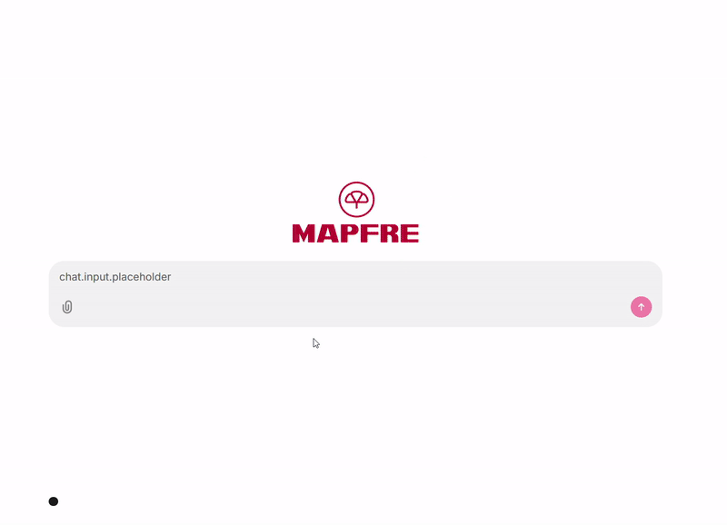

🚀 # **Multimodal RAG Chatbot for MAPFRE | Master's Thesis Project**  

📌 ## **Project Overview**  

This project is a Master’s Thesis focused on developing a **Multimodal Chatbot** using **Retrieval-Augmented Generation (RAG)** for **MAPFRE**.  
The chatbot runs on **Chainlit** and provides an enhanced user experience for both **new and existing clients** seeking information about car insurance.  

Additionally, a **voice-enabled avatar** 🗣️ has been developed, allowing users to interact via **voice commands** 🎙️. However, this feature is separate from the RAG-based retrieval system.  

🎯 ## **Objectives**  

The chatbot is designed to **improve the user experience** for both:  
✅ **New customers** looking to purchase car insurance.  
✅ **Existing customers** who have questions about their current policy or potential rate optimizations.  

🔍 ## **Key Features**  

- 🗣️ **Voice Interaction** via an AI-driven avatar.  
- 🤖 **RAG-based chatbot** that retrieves and generates **insurance-related responses**.  
- 📸 **Image processing capabilities**:  
  - Users can upload **car images** 🚗, and the chatbot will extract:  
    - License plate information 🔢  
    - Vehicle model 🚘  
    - Registration year 📆  
    - Color 🎨  
    - And more!  

## **GIF Demo**


## **Agentic Avatar View**


🔧 ## **Installation & Setup**  

### ⚙️ **Prerequisites**  

Before you can start using the **RAG Bot**, make sure you have the following prerequisites installed on your system:  

- 🐍 **Python 3.12** or higher  

### 📥 **Installation**  

1️⃣ Clone this repository to your local machine.  
  ```bash
  git clone https://github.com/ssillerom/tfm_valley_2025_g3.git
  cd RAG_CHATBOT

2️⃣ Install dependencies 📦

  poetry install

3️⃣ Access the environment 🔄

  poetry env activate

4️⃣ Configure the GOOGLE API KEY 🔑

    Create a google_api_key.txt file 📄
    Paste your API key into the file ✍️

5️⃣ Run the chatbot 🚀

  chainlit run app.py -w

6️⃣ (Optional) Run the voice-enabled avatar 🗣️🎙️

  python -m avatar
